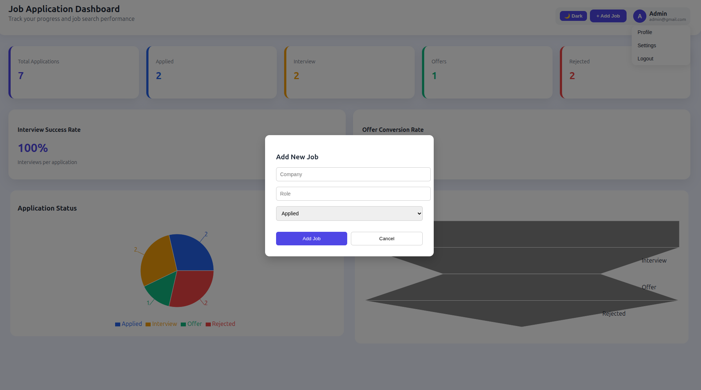
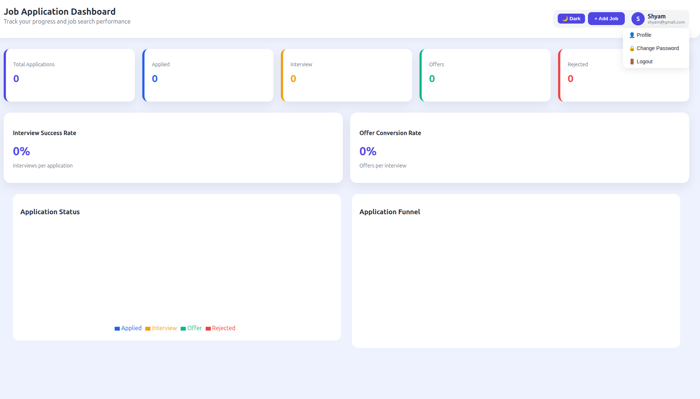
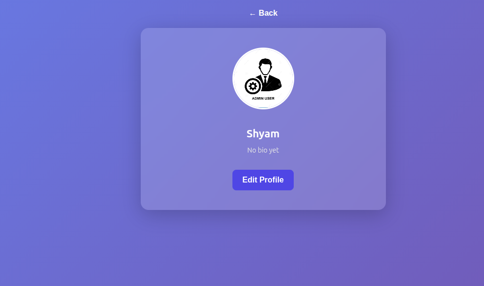
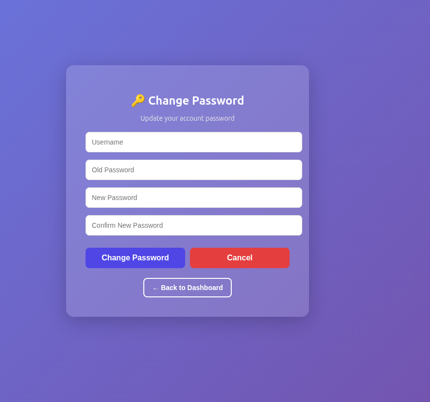
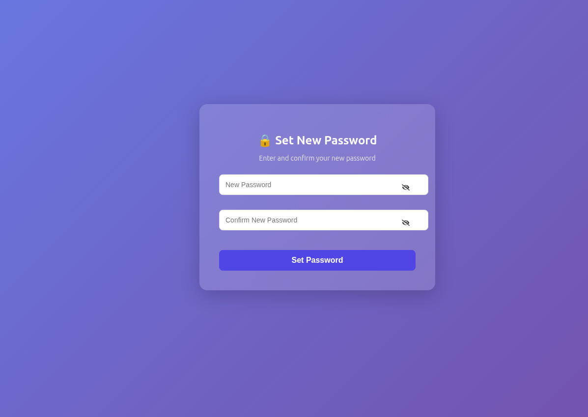

# 🚀 Job Tracker System – Installation & Setup Guide

A full-stack **Job Tracker System** built with **Django (Backend)** and **React (Frontend)** to manage and track job applications efficiently.

---

## 📁 Project Structure

This project is organized as a monorepo split into backend and frontend services:

```text
Job-Tracker/
├── backend/        # Django REST Framework Backend
└── frontend/       # React Frontend
```

---

## 📌 Prerequisites

Before starting, ensure you have the following installed:

- Python **3.10+**
- Node.js **18+** and npm
- Git
- Virtual environment support

---

## 🖼️ Application Screenshots

All screenshots are stored in the **`backend/CodeSnaps/`** folder.

---

### 📊 Dashboard





---

### 🔐 Login Page


---

### 📋 Job Listings / Kanban View


---

### 📌 More Screens










---

## 🔹 Installation Guide

### 🔸 Backend Setup (Django)

#### 1️⃣ Clone the Repository

```bash
git clone https://github.com/sameer9860/Job-Tracker.git
cd Job-Tracker
```

---

#### 2️⃣ Create Virtual Environment

```bash
cd backend
python -m venv job_env
```

---

#### 3️⃣ Activate Virtual Environment

**Windows (PowerShell)**

```powershell
.\job_env\Scripts\activate
```

**Windows (CMD)**

```cmd
job_env\Scripts\activate
```

**macOS / Linux**

```bash
source job_env/bin/activate
```

---

#### 4️⃣ Configure Environment Variables

```bash
cp .env.example .env
```

Edit `backend/.env` and set your `SECRET_KEY` and other values as needed.

---

#### 5️⃣ Install Backend Dependencies

```bash
pip install -r requirements.txt
```

---

#### 6️⃣ Apply Database Migrations

```bash
python manage.py migrate
```

---

#### 7️⃣ Create Superuser (Admin)

```bash
python manage.py createsuperuser
```

👉 Follow the prompts to create an admin account.

---

#### 8️⃣ Run Django Development Server

```bash
python manage.py runserver
```

🌐 Backend URL: **[http://127.0.0.1:8000/](http://127.0.0.1:8000/)**

---

### 🔸 Frontend Setup (React)

#### 9️⃣ Navigate to React Frontend

Assuming you are in the `backend` directory, navigate back and enter the `frontend` folder:

```bash
cd ../frontend
```

---

#### 🔟 Install Frontend Dependencies

```bash
npm install
```

---

#### 1️⃣1️⃣ Start React Development Server

```bash
npm start
```

🌐 Frontend URL: **[http://localhost:3000/](http://localhost:3000/)**

---

## ✅ Features

* User Authentication & Authorization (JWT based)
* Job Application Tracking (Add, Edit, Delete Jobs)
* Kanban Board / Status Pipeline Management
* Dashboard with statistics, charts, and reminders
* Profile Management and Password Reset with OTP
* Responsive UI with light/dark theme support

---

## 🛠️ Tech Stack

* **Backend:** Django, Django REST Framework, SimpleJWT
* **Frontend:** React, TailwindCSS / Vanilla CSS, ChartJS / Recharts
* **Database:** SQLite / PostgreSQL
* **Version Control:** Git & GitHub

---

## 🤝 Contributing

Contributions are welcome!

1. Fork the repository
2. Create a new branch
3. Commit your changes
4. Push to the branch
5. Open a Pull Request

---

⭐ If you like this project, don’t forget to give it a star on GitHub!
